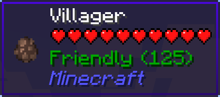
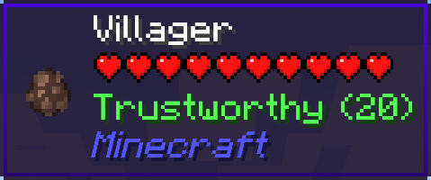

# Your Reputation

Your Reputation is a [WTHIT](https://www.curseforge.com/minecraft/mc-mods/wthit) plugin that displays your reputation on a tooltip with each villager.

| Reputation  | Value                          | Tooltip                       |
| ----------- | ------------------------------ | ----------------------------- |
| Friendly    | 100 or more                    |     |
| Trustworthy | more than 0 and less than 100  |  |
| Neutral     | equal to 0                     |      |
| Suspicious  | more than -100 and less than 0 |   |
| Hostile     | -100 or less                   |      |

If your reputation is "Hostile", villagers may be snitches.

And then, iron golems will get angry and attack you...

## License

Your Reputation mod is licensed under the MIT License, see [LICENSE](./LICENSE).
